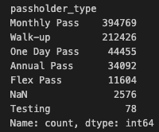
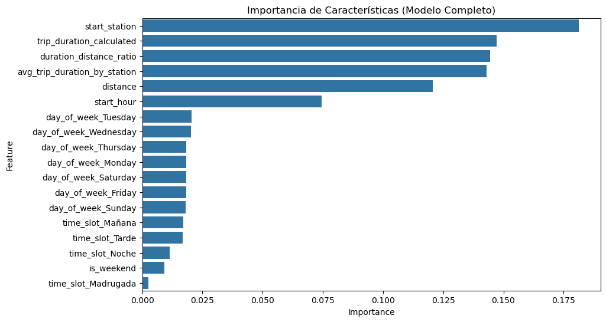

# Prueba técnica DS

## EDA
Exploratorio de datos: Para comenzar la asignación se requiere realizar un análisis exploratorio de datos que busque contestar preguntas relevantes a los siguientes dos temas:

- Saturación del servicio: La empresa busca contar con la disponibilidad más alta de servicio en el mercado, por lo que se quiere entender cómo se comporta la demanda de servicio en las istintas estaciones y horarios para cada plan 
    - Se tomó en consideración solo el dataset de train, las 10 estaciones con mayor demanda de viajes son: 

    

        
    

    - Si se analiza a qué tipo de pase se atribuye más en cada estación se observa:

     

        
    

    - La distribución general del tipo de pase es el siguiente según la hora del día:

    

        
    

    - Una manera de profundizar en la capacidad de cada estación también fue graficar la proporción de viajes para este top 10 de estaciones según la madrugada, mañana, tarde y noche; el criterio de segmentación de estas franjas horarias es: [0:00-6:00 horas] madrugada ; [6:00-12:00] mañana ; [12:00-18:00] tarde ; [18:00-24:00] noche.

     

        
    

    - Ahondando en el análisis por día, se puede observar para cada día de la semana la distribución de las 5 estaciones más demandas es la siguiente:

    

        
    

- Crecimiento de planes: Se tiene la intuición que la tendencia en uso de bicicletas compartidas entre estaciones va a la alta, por lo que se requiere realizar una correcta planicación de bicicletas que deben tener. Adicionalmente, se espera que los planes de consumo anual crezcan en mayor proporción 

    - Para entender el comportamiento compartido se debe ver la tendencia de uso de los planes según la linea temporal, lo cual se puede observar en el siguiente gráfico:
    - En este punto mediante un pequeño modelo de regresión lineal, se estimó la demanda de los siguientes 3 meses para cada plan, las observaciones se observan en el output de la tabla mostrada en esta sección. Cabe resaltar que las estimaciones en valores negativos deberán de interpretarse como planes que no aportarán a la demanda o que su tendencia es a la baja

    

        
    

     

        
    
 

    - La distribución de bicicletas compartidas por estación se comporta o puede verse reflejada en el siguiente gráfico

    

        
    
 

    - La parte que más interesa poner atención es la cola de la campana con balance negativo, esto quiere decir que dada la alta demanda de bicicletas se cuenta con una oferta baja de las mismas en diferentes estaciones. 

        - Realizando un cruce entre las estaciones con mayor demanda y aquellas con más deficit se tiene que aquellas a las que debemos dar más atención son:

    

        
    

## Modelo

- Se creó un modelo que ayudará a inferir el tipo de pase a partir de la información disponible, para este modelo los siguientes pasos fueron considerados: 
    - En este punto se creo un código modularizado en clases que trató de aislar el típico flujo de trabajo para construir un modelo de machine learning: 
        - Limpieza y homologación de datos:
        Se creó una clase que primeramente eliminara NaNs, nulos o valores vacíos de la variable objetivo, para variables tipo fecha se crearon los campos necesrios y del resto de las variables, sobre todo las de coordenada geográfica, se imputaron por la mediana. (puede verse esto en el archivo clean_datasets.py) 
        - Feature engineering:
        Con las variables que se contaba, poco se podía hacer. De modo que se crearon variables que dieran mucho más contexto al fenómeno del uso de bicicletas como distancia entre un punto y otro para cada viaje, estación de inicio, hora del día, día de la semana, franja horaria en el que fue realizado el viaje y se recalculó la duración de dichos viajes ya que la variable que se tenía no estaba del todo bien calculada. (esta parte se puede ver en el archivo feature_engineering.py) 
        - Data preprocessing y balanceo de clase:
        En este punto y para que el modelo pudiera realizar una predicción acertada, se preprocesaron las variables para el uso de los modelos, se removieron outliers que estaban marcados por viajes con tiempos muy altos o enormes distancias recorridas, adicionalmente y dado el desbalanceo de clases que existía en la variable onbjetivo técnicas de sobre muestreo y sub muestreo en las clases desbalanceadas fueran puestas a prueba. (ver el archivo data_preprocess.py y model_develop.py) 

        

            
        
 

        - Entrenamiento y selección de modelo:
        Una vez procesados los datos, eliminado ruido y adicionados los features se procedíó a entrenar 2 modelos de clasificación. Un Random forest y un Xgboost. Para este punto, de igual manera tuvo que realizar algunas mejoras, como incorporar los datasets rebalanceados, hacer la búsqueda de los mejores hiper parametros posibles para cada modelo y un cross validation para probar en diferentes datasets y particiones del conjunto de entrenamiento y así eliminar sesgos, overfit o underfit. Situación que pasó en una primer fase experimental pero fue solventado con un cross validation y el agregar un par de features más al análisis (Promedio de duración de viajes por estación de inicio e Interacciones entre variables) (ver el archivo model_develop.py) 
        - Ejecución del modelo:
            - A continuación se deja la instrucción para la ejecución de lo anterior:
                - Abre tu terminal y navega al directorio principal o root de este proyecto.
                - Ejecuta: `python main.py`
                - El resultado es un archivo con los trips_id del conjunto de test y las predicciones del modelo de random forest y el del xgboost 
        - Resultados:
            - Para este problema de clasificación, se decidió valura por accuracy de predicción para cada clase y por modelo. Se tiene lo siguiente:

             

                
                
 Métricas del modelo Random Forest 

            
 

            

                
                
 Métricas del modelo XGboost 

            
 

            - En general se tiene que Random Forest es mejor modelo en parte a lo siguiente:
                - Mayor accuracy
                - Mejor desempeño promedio (macro y weighted avg).
                - Desempeño más equilibrado en clases desbalanceadas.
        Sin embargo, XGBoost no está muy lejos, y con ajuste de hiperparámetros adicionales podría mejorar.

        - Las variables que más influenciaron en la predicción para cada caso son:

        

                
                
 Feature importance del modelo Random Forest 

        
 

        

                
                
 Feature importance del modelo XGBoost 

        
 
            

